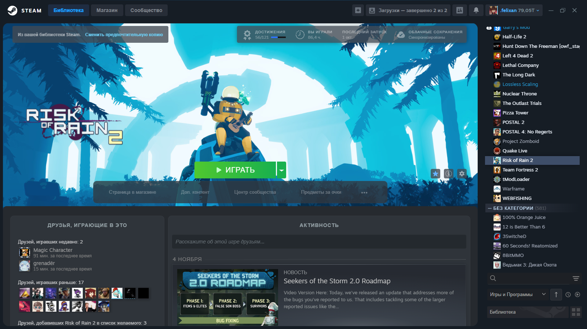

# NEVKO-UI
### Theme for Millennium for Steam

(Still Mega WIP, Things may change.)

(And when I'm finished with the design, I'll rewrite all the code and make everything customized)

 # TODO:
 1. Accents [CSS]
 2. Solar Icons [CSS]
 3. Popup Settings (Big Pic, VR) [JS] 
 4. Web Alt Design [CSS, Maybe JS]
 5. Everything Customized by User [Json. Millennium Settings]
 6. etc. [CSS & JS]

# CREDITS -
### Authors of themes i borrowed code from:

shdwnstr_ - [JS & CSS Code from CompactHeader]

ShadowTeam - [CSS Code for Menu]

### People who helped me with the code:

motionarium - Extra Buttons & Driver [JS]
